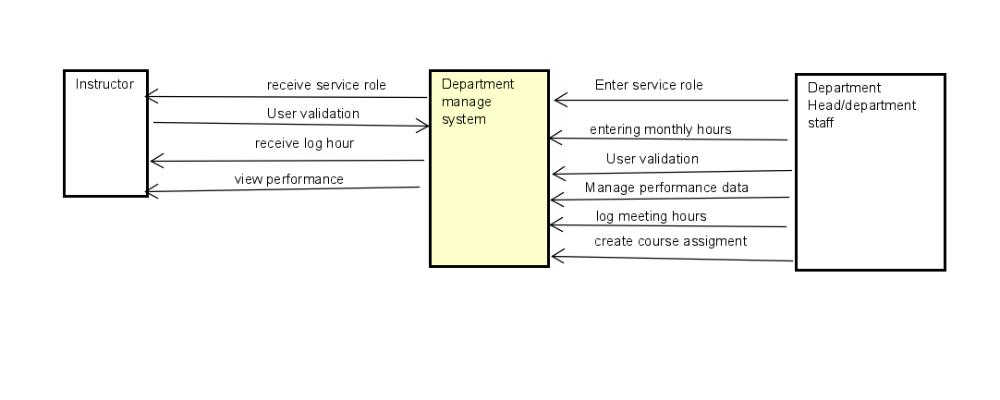
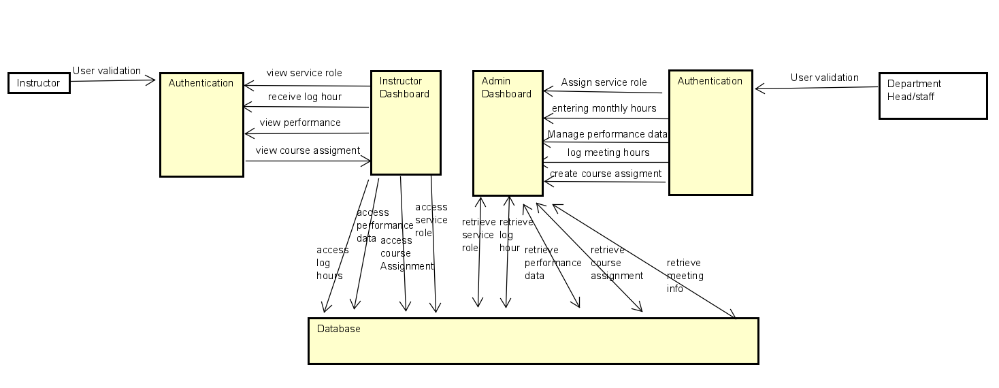

# System Design

## Introduction

Start with a brief introduction of **what** you are building, reminding the reader of the high-level usage scenarios (project purpose).   Complete each section with the required components.  Don't forget that you can include [images in your markdown](https://docs.github.com/en/get-started/writing-on-github/getting-started-with-writing-and-formatting-on-github/basic-writing-and-formatting-syntax#images).  

Start each section with a lead-in, detailing what it is.  Also, do not just have a collection of images.   Each diagram must be explained clearly. **Do not assume that the reader understands the intentions of your designs**.

## System Architecture Design

Recall the system architecture slides and tell us which architecture pattern you are using and why (it may also be something not in the slides or be a combination). Provide more details about the components you have written, and where these components fit in the overall architecture so we can visualize how you have decomposed your system. Basically, this should all be captured in ONE diagram with the components on them and a few sentences explaining (i) why you chose this architecture and (ii) why the components are where you put them. If you want to just focus on a certain aspect of your system and not show the entire architecture for your system in the diagram, that should be fine as well.

## Use Case Models

Extending from your requirements, the team will need to develop a set of usage scenarios for each user group documented as properly dressed use cases  (including diagrams following the UML syntax and descriptions as presented in class).   You may also want to include journey lines with some use cases. 

## Database Design 

Provide an ER diagram of the entities and relationships you anticipate having in your system (this will most likely change, but you need a starting point).  In a few sentences, explain why the data is modelled this way and what is the purpose of each table/attribute.  For this part, you only need to have ONE diagram and an explanation.

## Data Flow Diagram (Level 0/Level 1)
### Level 0

This Level 0 Data Flow Diagram (DFD) depicts the interactions between the Instructor, the Department Management System, and the Department Head/Department Staff within an educational institution. 

In this diagram, the instructor can do the following:
- The instructor's credentials are validated by the Department Management System.
- The instructor receives their service role from the department head or the department staff.
- The instructor views their expected working hours from the Department Management System.
- The instructor views their performance data through the Department Management System.

And the Department Head and Staff can do the following:
- The department head/staff undergo user validation by the system.
- The department head/staff input the service roles into the Department Management System.
- The department head/staff log expected monthly hours for the instructors into the system.
- The department head/staff manage performance data within the system.
- The department head/staff create and log meeting hours into the system.
- The department head/staff create course assignments within the system.

For the departemnt manage system, This is the central system that manages various operations and data flows between instructors and the department head/staff. It contains the following interactions:
- The department head/staff enters service roles into the system.
- The department head/staff enter the monthly working hours of the instructors.
- The system validates the credentials of both instructors and department head/staff.
- The system manages performance data for instructors.
- The system logs meeting hours.
- The system allows the creation of course assignments.

### Level 1
This Level 1 Data Flow Diagram (DFD) provides a more detailed view of the processes and data interactions within the system, involving the Instructor, Department Head/Staff, and various system components.

First, the instructor, department head and department staff need to g0 through the authentication process inorder to log in to the system. 

Once authenticated, instructors can view their service roles, log hours, view performance data, and view course assignments. And the department head/staff can assign service role, entering monthly hours, manage performance data, log meeting hours and create course assignments.All these operations are done through the dashboard of instructor or admin.  

The instructor dashboard interfaces with the database to access performance data, log hours, service roles, and course assignments for the instructors.

The admin dashboard is used by department heads or staff to assign service roles, enter monthly hours, manage performance data, log meeting hours, and create course assignments. This dashboard stores and retrieves necessary information into or from the database.

Lastly, about the database. The database stores and provides access to log hours, performance data, service roles, and course assignments. The database also retrieves data for both the instructor and admin dashboards.

## User Interface (UI) Design

